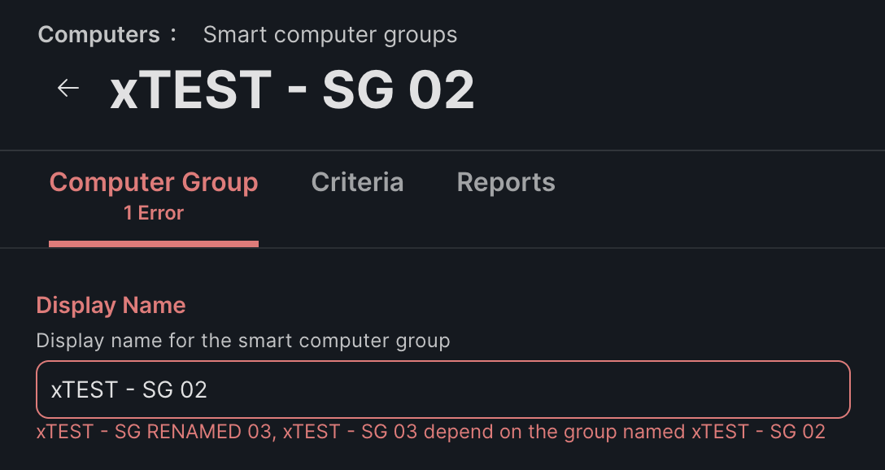
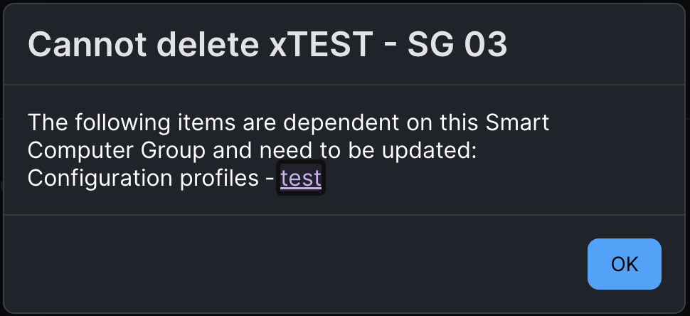

# Jamf Smart Group Renamer

Renames a Jamf Pro smart computer group and repairs everything that referenced it.

Standard library Python. Nothing to install.

## The problem

Jamf Pro stores group references in two different ways, and both get in the way of a
rename.

**Smart group criteria store the group by name.** While another group refers to it,
the rename is refused.



**Policy and profile scopes store the group by ID.** Those survive a rename, but they
stop the old group being deleted.



The usual workaround is to strip the dependent criteria, rename, then put them back.
That leaves those groups without criteria for a while, and because membership
recalculates on inventory submission, devices can drop into the wrong group and pick
up a policy or profile they were never meant to receive.

## What it does instead

1. Reads the target group and everything that references it
2. Writes a full backup
3. Creates a new group with the new name and identical criteria
4. Waits for membership to match
5. Repoints dependent group criteria
6. Re-scopes affected policies and configuration profiles
7. Verifies nothing refers to the old name
8. Removes the original

No group is ever left without its criteria, and the original is only removed once
nothing depends on it.

## Requirements

- Python 3.8 or later
- Either an API client, or a Jamf Pro user account, with read and write access to
  computer groups, policies and configuration profiles

### Authentication

An **API client** is recommended, and is the only option where console login uses
single sign on, since user credentials cannot be used against the API in that case.

Create one under **Settings > System > API roles and clients**. Add an API role
granting Create, Read, Update and Delete on Smart Computer Groups, Policies and
macOS Configuration Profiles, then create a client using that role. Requires Jamf
Pro 10.49 or later.

An API client also carries only the privileges granted to its role and can be
revoked without affecting anyone's login, so it is worth using even where local
accounts still work.

A **username and password** remains available for instances using local Jamf Pro
accounts.

## Usage

Download the script from the [latest release](../../releases/latest), or clone the
repository:

```bash
git clone https://github.com/neil-bh/jamf-smart-group-renamer.git
cd jamf-smart-group-renamer
python3 jamf_smart_group_renamer.py
```

You are prompted for the server, credentials, the group to rename and the new name,
which must be typed twice.

Nothing is written until the review stage is complete. Once changes begin the run
finishes without further prompting, so a timeout cannot leave the work half done.

## Limitations

- **Objects with duplicate names cannot be updated.** The Classic API returns
  `409 Duplicate name` for any update to a policy or profile whose name is shared,
  even though the Jamf Pro interface permits the duplicate. The tool stops before
  making any change and tells you which names to resolve, so nothing is left half
  done. See [#1](../../issues/1)
- **Blueprints are not covered.** They use a separate API. Update any Blueprint
  scoped to the renamed group by hand
- **Computer groups only.** Mobile device groups are not supported
- **Only policies and configuration profiles are re-scoped.** Other scopable objects
  are not checked

## Files written

| File | When |
|---|---|
| `jamf-rename-backup-<timestamp>.json` | Every run, before any change |
| `jamf-rename-errors.log` | Only when an update fails |

Both are excluded by `.gitignore`.

## Contributing

Issues and pull requests welcome. Open issues track the current backlog.

Run `python3 tests/test_offline.py` before opening a pull request. It needs no
Jamf Pro instance and no credentials.

## Licence

MIT
